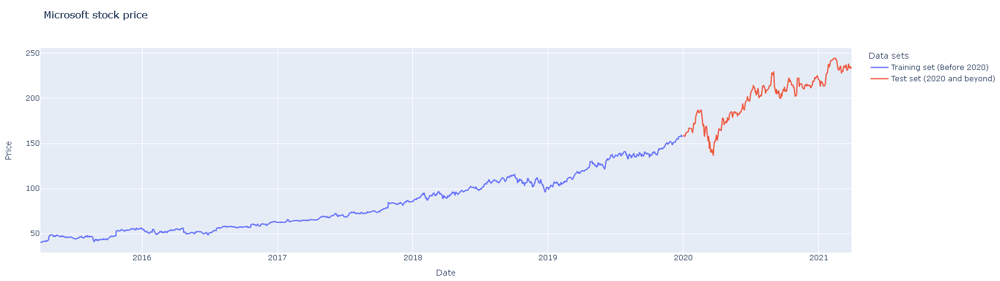

# Microsoft Stock Price Prediction with GRU

This project aims to amateurishly predict Microsoft's stock prices using the GRU model.

## Dataset

Microsoft Stock Price dataset from Kaggle platform is used as the dataset.

Dataset url: https://www.kaggle.com/datasets/vijayvvenkitesh/microsoft-stock-time-series-analysis/

A visualized version of the dataset is given in the figure.

## Results
The new visualization made with the predictions of the GRU model is given in the
visualization. As can be seen, a larger data set (longer time series of stock prices) 
and more complex models than the one used in the project can be used to improve the 
model that does not predict well. Of course, it will still not make very consistent 
predictions. This can be attributed to environmental factors (e.g. politics, war, 
corporate interest) that may affect stock prices.

